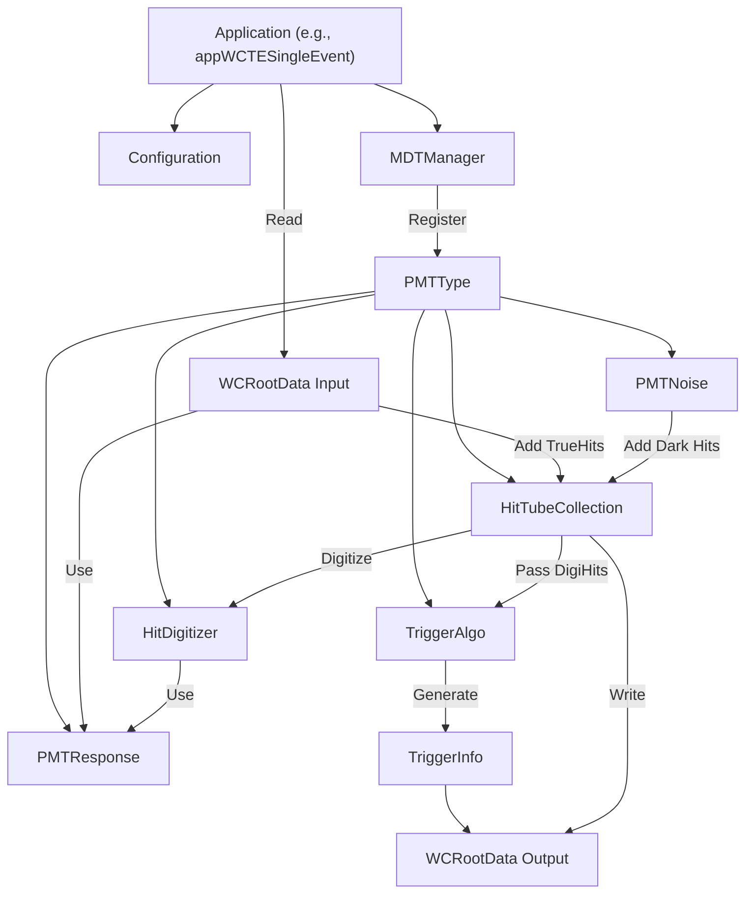

# MDT Technical Documentation

## 1. System Overview

**MDT** is a C++ library designed to post-process simulation output from **WCSim** (Water Cherenkov Simulator). Its primary function is to bridge the gap between "True Hits" (Monte Carlo photoelectrons) and "Digitized Hits" (ADC counts and timestamps representing electronic readout).

The system is architected around three main phases:
1.  **Merging**: Combining true hits from multiple sources (e.g., neutrino interactions + beam background) and adding intrinsic PMT noise (Dark Rate).
2.  **Digitizing**: Simulating the PMT and electronics response to convert photoelectrons (PE) into digital time and charge.
3.  **Triggering**: Applying detector trigger logic to select events of interest.

## 2. Core Library Architecture (`cpp/`)

The core logic resides in `cpp/src` and `cpp/include`. The architecture relies heavily on polymorphism to handle different PMT types and digitization models.

### 2.1. PMT Response Model (`PMTResponse`)

The `PMTResponse` class hierarchy defines how a specific PMT behaves physically (Quantum Efficiency, Transit Time Spread, Gain).

*   **Base Class**: `PMTResponse` (Abstract)
    *   **Interface**:
        *   `GetRawSPE(...)`: Returns the charge of a Single Photoelectron (SPE), typically drawn from a distribution, for standard `HitDigitizer`.
        *   `HitTimeSmearing(Q)`: Returns the time jitter (resolution) based on charge `Q`, for standard `HitDigitizer`.
        *   `ApplyDE(...)`: Determines if a photon is detected based on angular efficiency.
*   **Generic Implementation**: `GenericPMTResponse`
    *   Handles loading standard configuration files:
        *   **SPE CDF**: Cumulative Distribution Function for charge generation.
        *   **PMTDE**: mPMT_ID-dependent angular efficiency maps.
        *   **PMTTime**: PMT-specific timing offsets.
*   **Specific Implementations**:
    *   `ResponseBoxandLine20inchHQE`: Implements a specific time smearing model using `ksig_param` and `klambda_param`.
    *   `Response3inchR14374_WCTE`: Uses a `TGraph` (`gTResol`) to interpolate timing resolution as a function of charge.

### 2.2. Digitization Logic (`HitDigitizer`)

The `HitDigitizer` class is responsible for converting a collection of True Hits on a single PMT into Digitized Hits.

*   **Base Class**: `HitDigitizer`
    *   **Standard Algorithm (`DigitizeTube`)**:
        1.  Sorts true hits by time.
        2.  Iterates through hits using an **Integration Window** (`fIntegWindow`).
        3.  Sums charge of all hits within the window.
        4.  Applies `HitTimeSmearing` from the `PMTResponse` object.
        5.  Applies `ApplyThreshold` to simulate DAQ efficiency/thresholds.
        6.  Truncates values to simulate electronics precision (`fPrecisionTiming`, `fPrecisionCharge`).
*   **Waveform Digitizer**: `HitDigitizer_mPMT`
    *   **Purpose**: Simulates the full voltage waveform for multi-PMT (mPMT) setups or advanced analysis.
    *   **Workflow**:
        1.  **`BuildWavetrain`**: Superimposes SPE pulse shapes (loaded from `WaveformFile`) onto a histogram based on true hit times. The SPE amplitude is sampled from a Gaussian distribution of width `fAmplitudeSigma`.
        2.  **`FitWavetrain`**: Analyzes the generated waveform to extract hits.
            *   **Hit Finding**: Looks for local maxima exceeding `fAmplitudeThreshold`.
            *   **Time**: Uses Linear Interpolation (CFD-like) to find the zero-crossing point.
            *   **Charge**: Integrates samples around the peak (`fChargeWindowBefore`, `fChargeWindowAfter`).

### 2.3. Noise and Afterpulsing (`PMTNoise`)

*   **Dark Noise**:
    *   `GenerateDarkNoise`: Calculates the number of noise hits using a Poisson distribution based on `fDarkRate` and the time window.
    *   `AddPhotoElectrons`: Injects these noise hits into the `HitTubeCollection` as if they were true photons.
*   **Afterpulsing**:
    *   `AddAfterpulse`: Iterates through *digitized* hits. If a hit triggers an afterpulse (probabilistic), a new hit is generated with a time delay and charge, then added to the digitizer.

### 2.4. Triggering Logic

The library implements a trigger simulation via the `TriggerAlgo` class to determine if an event should be recorded, mimicking the Data Acquisition (DAQ) logic. Results are stored in `TriggerInfo`.

*   **Classes**:
    *   `TriggerAlgo`: Handles the trigger logic. Configured via `MDTParFile`.
    *   `TriggerInfo`: Container for trigger results (Trigger Time, Readout Window Start/End, Number of Hits, Trigger Type).

*   **Algorithms**:
    *   **NDigits** (`TriggerType = NDigits`):
        1.  Collects and sorts all digitized hit times from the `HitTubeCollection`.
        2.  Slides a time window of width `NDigitsWindow` with step `NDigitsStepSize`.
        3.  **Condition**: Fires if hit count > `NDigitsThreshold`.
        4.  **Readout**: Saves hits within [`TrigTime` + `PreTriggerWindow`, `TrigTime` + `PostTriggerWindow`].
        5.  **Overlap**: Adjusts the start of the readout window if it overlaps with a previous trigger to avoid duplication.
        6.  **Failure**: If no trigger is found, a "Failure" trigger is recorded (typically with a specific failure time and window).
    *   **NoTrig** (`TriggerType = NoTrig`):
        *   Forces a trigger at T=0. Useful for saving fixed windows or debugging.

*   **Usage in MDTManager**:
    *   `DoTrigger(pmtType)`: Invokes `TriggerAlgo::DoTrigger`.
    *   `GetTriggerInfo(pmtType)`: Returns the populated `TriggerInfo` object.

## 3. Application Layer (`app/`)

The `app/` directory contains executable applications that utilize the core library to process WCSim files.

### 3.1. Common Workflow Patterns
Most applications follow this sequence:
1.  **Configuration**: Read parameters (Singleton `Configuration` class).
2.  **Initialization**: Instantiate `MDTManager` and register PMT types.
3.  **Event Loop**:
    *   Read `wcsimrootevent` (True Hits).
    *   **AddTrueHits**: Pass hits to MDT.
    *   **DoAddDark**: Add noise.
    *   **DoDigitize**: Convert to DigiHits.
    *   **DoTrigger**: Run trigger logic (e.g., `MDT->DoTrigger(pmtType)`).
    *   **Write**: Retrieve trigger info (`MDT->GetTriggerInfo`) and save DigiHits to output ROOT file.

### 3.2. Key Applications

*   **`appGenPileUpSpill`**:
    *   **Purpose**: Generates "spills" containing multiple neutrino interactions and beam background events (e.g., for T2K/Hyper-K).
    *   **Logic**:
        *   Uses `WCRootDataIDNuInt` and `WCRootDataBeamBkg` to manage input files.
        *   Uses `BeamTiming` to distribute events in time according to beam bunch structure.
        *   Merges hits from all interactions into a single `MDTManager` instance before digitizing.
*   **`appWCTESingleEvent` / `appIWCDSingleEvent`**:
    *   **Purpose**: Standard processing for single-event simulations (1 input event = 1 output event).
    *   **Difference**: `WCTE` uses specific PMT model (`Response3inchR14374_WCTE`), while `IWCD` supports hybrid ID+OD configurations.

## 4. Class Dependency & Data Flow



## 5. Developer Guide: How to Extend

### 5.1. Adding a New PMT Type
To add a new PMT model (e.g., a new 3-inch PMT):
1.  **Create Header/Source**: Create `PMTResponseNewType.h` and `.cc`.
2.  **Inherit**: Inherit from `GenericPMTResponse`.
3.  **Implement**:
    *   `Initialize()`: Load specific parameters.
    *   `HitTimeSmearing(float Q)`: Define the timing resolution function.
4.  **Register**: In your application (e.g., `app/application/MyApp.cc`), include the header and register it:
    ```cpp
    MDT->RegisterPMTType("PMTNewType", new PMTResponseNewType());
    ```

### 5.2. Customizing Digitization
To change how waveforms are processed:
1.  **Modify `HitDigitizer_mPMT`**:
    *   Update `BuildWavetrain` if the pulse superposition logic changes.
    *   Update `FitWavetrain` to implement new hit-finding algorithms (e.g., changing from CFD to a fixed threshold or template fitting).
2.  **Configuration**: Ensure `DigitizerType` is set correctly in the parameter file, and `WaveformFile` points to the correct SPE pulse shape.

### 5.3. Adding New Trigger Logic
1.  Implement logic in `TriggerAlgo` that scans `HitTubeCollection` for `DigiHits` meeting coincidence criteria (e.g., NDigits).
2.  Ensure `TriggerInfo` is populated with the correct trigger time and readout window.

## 6. Configuration Parameters
The system is driven by text-based parameter files. Key parameters include:
*   **`DigitizerType`**: Selects between standard (WCSim) or waveform digitizer.
    *   `WaveformFile`: Path to the text file containing the waveform pulse shape (Time vs Voltage).
*   **`DarkRate`**: PMT dark noise rate in kHz.
*   **`PMTDE`**: Path to PMT angular efficiency file.
*   **Trigger Parameters**:
    *   `TriggerType`: `NDigits` or `NoTrig`.
    *   `NDigitsWindow`: Width of the sliding window (ns).
    *   `NDigitsThreshold`: Minimum number of hits to fire a trigger.